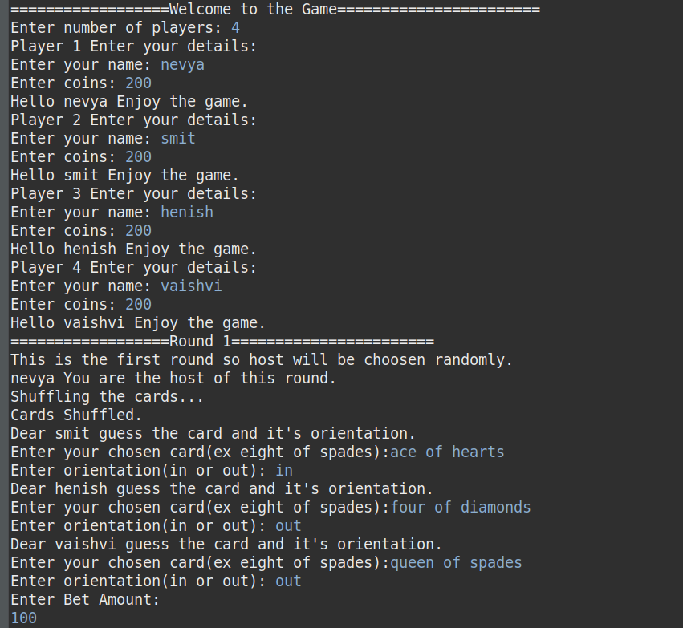
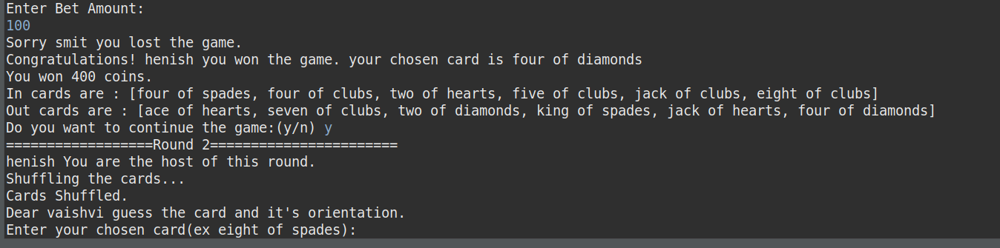

# Mangatha-the-card-game

The game of “Mangatha” is played in the following way:
There can be as many players as you like.
In the first round, one player is randomly selected as the host.
Every single player other than the host selects a particular card (say, the 8 of Spades), and
selects a particular orientation (in or out), and places their bet (say, 5 coins).
The host of the game then shuffles a full deck of cards and starts dealing them into the two
orientations, in and out. The host opens the first card, places it in, opens the second card,
places it in out, third card goes in, fourth card goes out, and so on.
The first time a card selected by any player falls in the orientation they have selected, that
player is declared to be the winner and pockets all the bets in the round. They then become the
host for the next round.
If there are no winners among the rest of the players, ie, all the cards have fallen on the
opposite orientation as what the players picked, then the host wins and takes all the winnings
and retains their status as host.
Every player has to either place a bet or call it quits and leave the game, which they are allowed
to do before placing the bet.
Write a set of Java classes to play a three-player game of Mankatha. (you can use the Card
class you’ve already created)
You could have a Player class with a betValue, a chosenCard, and a chosenOrientation.
You probably need a Deck class that contains all the 52 cards in an ordered list which contains
a shuffle() method that shuffles the cards and a deal() method that removes and returns the
topmost card in the deck, and a reset() method that resets the deck to its default ordered state
of 52 cards.
You probably also need a Game class that contains a findWinner() method that checks if the
current dealt card represents any player winning, which can help you decide the winner of the
current round, set the new host, and continue the game.

# Screenshots of Implementation

continue...till host stops the game
